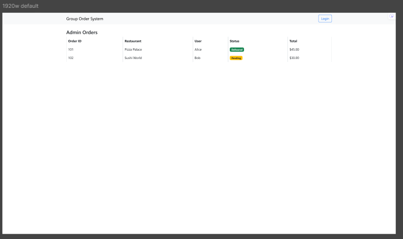

# Oct Delivery System - Group Food Ordering Platform

Hey there! Welcome to our collaborative food ordering system. This project was built to solve a real problem we face every day - coordinating group food orders in our office/dorm. Instead of the usual chaos of collecting orders via WhatsApp and dealing with payment headaches, we created this web application to make group ordering simple and organized.

## What's This All About?

This system lets groups of people (like office colleagues or students) coordinate their food orders from local restaurants. One person creates an order, others join in, and everyone can track their individual items and payments. No more "who ordered what?" or "who owes how much?" confusion!

## 📋 Submission Contents

This project includes all required deliverables for the course submission:

### 🎨 UX Design Documents
- **Figma Project**: [Complete UI/UX Design System](https://www.figma.com/design/ha96dwhVWdDJ6afpUBn5l3/Untitled?node-id=0-1&p=f&t=dE3wKqLEE9TVgXrr-0)
- **UX Research & User Personas**: Detailed in the submitted presentation
- **Wireframes & Prototypes**: Available in the Figma workspace
- **User Journey Maps**: Documented in our design process

### 📱 Mobile Application
- **Flutter Mobile App**: Native mobile application built with Flutter
- **Mobile App Demo Video**: `docs/videos/flutter_app_demo.mp4`
- **Why Flutter over Bravo Studio**: Bravo Studio is a low-code platform with limitations - only 15 pages max, no dynamic content support, and difficult Express.js backend integration. Flutter gives us the flexibility we need for our complex order management features.
- **Responsive Web Design**: Also works seamlessly on mobile browsers

### 💻 Web Application
- **Desktop Screen Recording**: `docs/videos/desktop_website_demo.mp4`
- **Live Website**: Fully functional web application
- **Source Code**: Complete project files included

### 🗄️ Database
- **Cloud Database**: MongoDB Atlas (connection details in setup guide)
- **Database Schema**: Documented in project structure
- **Sample Data**: Scripts included for testing

## Table of Contents
- [Key Features](#key-features)
- [Live Demo & Screenshots](#live-demo--screenshots)
- [Project Architecture](#project-architecture)
- [Getting Started](#getting-started)
- [Database Configuration](#database-configuration)
- [API Documentation](#api-documentation)
- [Testing Accounts](#testing-accounts)
- [Deployment Guide](#deployment-guide)
- [Demo Videos](#demo-videos)

## Key Features

Here's what makes our platform special:

### 👥 For Regular Users
- **Easy Login**: Simple username/password authentication
- **Browse Restaurants**: Check out available restaurants and their menus
- **Create Group Orders**: Start a new order and let others join
- **Join Existing Orders**: Hop into orders created by colleagues
- **Track Your Items**: See exactly what you ordered and how much you owe
- **Payment Status**: Mark when you've paid your share
- **Order History**: Keep track of your past orders and spending

### 👨‍💼 For Administrators
- **User Management**: Add, edit, and manage user accounts
- **Restaurant Control**: Add new restaurants and manage their menus
- **Order Monitoring**: Overview of all orders and their status
- **Analytics Dashboard**: See usage statistics and popular restaurants
- **Payment Tracking**: Monitor who's paid and who hasn't

### 📱 Mobile-First Design
- **Responsive Layout**: Works perfectly on phones, tablets, and desktops
- **Touch-Friendly**: Easy navigation on mobile devices
- **Fast Loading**: Optimized for mobile data connections

## Live Demo & Screenshots

### 🔐 Getting Started - Login Experience
The login process is straightforward - just enter your username and password. We've designed it to work well on any device.


*Clean login interface that works on all devices*

<details>
<summary>📱 See how it looks on mobile and tablet</summary>


*Mobile version - easy to use with your thumb*


*Tablet view - perfect for touch interaction*
</details>

### 🏠 Your Dashboard - Where Everything Happens

Once you're logged in, you'll see your personal dashboard. This is where you can see active orders, join new ones, or start your own. Think of it as your command center for all things food-related.


*Your main hub for managing orders and seeing what's happening*

<details>
<summary>📱 Mobile and tablet views</summary>


*Mobile dashboard - all the important stuff at your fingertips*


*Tablet view - great for quick order management*
</details>

### 👨‍💼 Admin Control Panel

If you're an admin, you get access to additional tools for managing users, restaurants, and monitoring all the orders happening in the system.


*Admin overview - see everything that's happening in the system*

<details>
<summary>📱 Mobile admin panel</summary>


*Even admins need to manage things on the go*
</details>

#### Managing Orders (Admin View)

*Keep track of all orders - who's ordering what and when*

#### Adding New Restaurants

*Easy form to add new restaurants to the system*

### ⚠️ When Things Go Wrong

We've made sure that even our error pages are helpful and don't leave you stranded.


*Even errors look friendly and help you get back on track*

<details>
<summary>📱 Error pages on mobile devices</summary>


*Mobile-friendly error handling*


*Tablet error page - consistent experience across devices*
</details>

## Demo Videos

### 📱 Flutter Mobile App Demo
**File**: `docs/videos/flutter_app_demo.mp4`
This screen recording shows our Flutter mobile application, demonstrating:
- User login and authentication
- Native mobile navigation and UI
- Browsing restaurants and menus
- Creating and joining group orders
- Real-time order updates
- Payment tracking and status updates
- Cross-platform compatibility (iOS/Android)

### 💻 Desktop Website Demo
**File**: `docs/videos/desktop_website_demo.mp4`
Complete walkthrough of the web application including:
- User authentication flow
- Dashboard functionality
- Order creation and management
- Admin panel features
- Database interactions in real-time

## Project Architecture
We built this using a pretty standard web stack that's reliable and easy to work with:

### 🏗️ Tech Stack
- **Backend**: Node.js with Express.js (solid and straightforward)
- **Database**: MongoDB Atlas (cloud-based, so no local setup headaches)
- **Frontend**: EJS templates with Bootstrap 5 (responsive out of the box)
- **Mobile App**: Flutter (cross-platform native performance)
- **Authentication**: Session-based auth (keeps things simple)
- **Deployment**: Vercel (easy deployment and hosting)

### 📱 Why Flutter Instead of Bravo Studio?

We initially considered Bravo Studio for the mobile app, but ran into several limitations:

- **Page Limit**: Bravo Studio only supports 15 pages maximum, which isn't enough for our complex order management system
- **Dynamic Content**: No support for dynamic content, which we absolutely need for real-time order updates and user-generated content
- **Backend Integration**: Very difficult to integrate with our Express.js backend and MongoDB database
- **Customization**: Limited customization options for our specific UI/UX requirements

Flutter gave us the flexibility to:
- Create unlimited screens and complex navigation flows
- Handle dynamic content and real-time updates seamlessly
- Integrate perfectly with our existing REST API
- Match our web app's design system exactly
- Build for both iOS and Android with one codebase

### 📁 How We Organized Everything
```
octdeliverysystem/
├── docs/                        # Documentation and demos
│   ├── videos/                 # Video demonstrations
│   │   ├── flutter_app_demo.mp4  # Flutter mobile app recording
│   │   └── desktop_website_demo.mp4 # Web app walkthrough
│   └── screenshots/            # UI screenshots for docs
├── flutter_app/               # Flutter mobile application
│   ├── lib/                   # Flutter source code
│   ├── android/               # Android-specific files
│   ├── ios/                   # iOS-specific files
│   └── pubspec.yaml           # Flutter dependencies
├── scripts/                    # Utility scripts
│   └── take-screenshots.js     # Automated screenshot tool
├── src/                        # Main web application code
│   ├── server.js              # App entry point
│   ├── middleware/            # Authentication & security
│   ├── models/                # Database schemas
│   │   ├── User.js           # User account data
│   │   ├── Restaurant.js     # Restaurant info & menus
│   │   └── Item.js           # Order items & tracking
│   ├── routes/               # API endpoints
│   │   ├── auth.js          # Login/logout handling
│   │   ├── items.js         # Order management
│   │   ├── restaurants.js   # Restaurant browsing
│   │   └── admin.js         # Admin panel features
│   ├── scripts/             # Database utilities
│   │   ├── initDb.js        # Set up fresh database
│   │   ├── createAdmin.js   # Create admin accounts
│   │   └── createRestaurants.js # Add sample restaurants
│   └── views/               # Web page templates
│       ├── login.ejs        # Login page
│       ├── items/           # Order-related pages
│       ├── restaurants/     # Restaurant browsing
│       └── admin/           # Admin panel pages
├── package.json             # Dependencies and scripts
├── vercel.json             # Deployment configuration
└── README.md               # This file!
```

## Getting Started

Want to run this locally? Here's how to get everything up and running:

### What You'll Need
- Node.js (version 14 or newer)
- A MongoDB Atlas account (free tier works fine)
- Git (to clone the project)

### Step-by-Step Setup

1. **Get the code**
   ```bash
   git clone <repository-url>
   cd octdeliverysystem
   ```

2. **Install dependencies**
   ```bash
   npm install
   ```

3. **Set up your environment**
   Create a `.env` file in the root folder with:
   ```env
   MONGODB_URI=your_mongodb_atlas_connection_string
   SESSION_SECRET=pick_a_random_secure_string
   NODE_ENV=development
   PORT=3000
   ```

4. **Initialize the database**
   ```bash
   npm run init-db
   ```

5. **Add some test data** (optional but recommended)
   ```bash
   node src/scripts/createAdmin.js
   node src/scripts/createRestaurants.js
   node src/scripts/createTestUser.js
   ```

6. **Start the server**
   ```bash
   npm run dev
   ```

That's it! Open your browser to `http://localhost:3000` and you should see the login page.

## Database Configuration

We're using MongoDB Atlas (cloud database) because it's way easier than setting up a local database. Here's how to get yours ready:

### Setting Up MongoDB Atlas (Free!)

1. **Create an account** at [MongoDB Atlas](https://www.mongodb.com/cloud/atlas)
   
2. **Create a cluster** (choose the free M0 Sandbox tier)
   - Pick a region close to you for better performance
   - The default settings work fine

3. **Set up database access**
   - Create a database user with a strong password
   - Write down these credentials - you'll need them!

4. **Configure network access**
   - Add `0.0.0.0/0` to your IP whitelist
   - This lets your app (and Vercel) connect from anywhere

5. **Get your connection string**
   - Click "Connect" → "Connect your application"
   - Copy the connection string
   - Replace `<password>` with your actual database password
   - This goes in your `.env` file as `MONGODB_URI`

## API Documentation

Our API is pretty straightforward. Here's what you can do:

### 🔐 Authentication Stuff
- `GET /auth/login` - Show the login page
- `POST /auth/login` - Actually log someone in
- `GET /auth/logout` - Log out and go back to login

### 🍕 Restaurant & Menu Browsing
- `GET /restaurants` - See all available restaurants
- `GET /restaurants/:id/menu` - Check out a specific restaurant's menu

### 📋 Order Management (The Main Features)
- `GET /items` - Your main dashboard with all orders
- `GET /items/new` - Start creating a new group order
- `POST /items` - Actually create the order
- `GET /items/:id` - See details of a specific order
- `POST /items/:id/join` - Join someone else's order
- `PUT /items/:id/payment` - Mark that you've paid
- `DELETE /items/:id/leave` - Remove yourself from an order

### 👨‍💼 Admin Features (For Admins Only)
- `GET /admin` - Admin dashboard with all the stats
- `GET /admin/users` - Manage user accounts
- `POST /admin/users` - Create new users
- `PUT /admin/users/:id` - Edit user details
- `DELETE /admin/users/:id` - Remove users (be careful!)
- `GET /admin/restaurants` - Manage restaurant listings
- `POST /admin/restaurants` - Add new restaurants
- `PUT /admin/restaurants/:id` - Update restaurant info
- `GET /admin/orders` - See all orders in the system

## Testing Accounts

We've set up some test accounts so you can try everything out:

### Regular User Account
- **Username**: `testuser`
- **Password**: `password123`
- **What you can do**: Create orders, join others, track payments

### Admin Account
- **Username**: `admin`
- **Password**: `admin123`
- **What you can do**: Everything a regular user can do, plus manage users and restaurants

> **Important**: These are just for testing! Change these passwords if you're using this in a real environment.

### Creating Your Own Accounts
If you want to create more test accounts, we've got scripts for that:

```bash
# Create a regular user (you'll be prompted for details)
node src/scripts/createUser.js

# Create another admin
node src/scripts/createAdmin.js

# Quick test user creation
node src/scripts/createTestUser.js
```

## Useful Commands

Here are all the commands you might need:

| What it does | Command | When to use it |
|-------------|---------|----------------|
| Start for development | `npm run dev` | When you're coding (auto-restarts) |
| Start normally | `npm start` | For production or testing |
| Set up database | `npm run init-db` | First time setup |
| Take screenshots | `npm run screenshots` | Update documentation |
| Create admin user | `node src/scripts/createAdmin.js` | Need admin access |
| Add sample restaurants | `node src/scripts/createRestaurants.js` | Populate with test data |
| Reset everything | `node src/scripts/resetDatabase.js` | Start fresh |

## Deployment Guide

We chose Vercel for deployment because it's simple and works great with Node.js apps.

### Deploy to Vercel

1. **Connect your GitHub repo** to Vercel (easiest way)

2. **Add environment variables** in the Vercel dashboard:
   - Go to Project Settings → Environment Variables
   - Add `MONGODB_URI` with your Atlas connection string
   - Add `SESSION_SECRET` with a secure random string
   - Set `NODE_ENV` to `production`

3. **Deploy!** Vercel will automatically build and deploy your app

### Running in Production Mode Locally
If you want to test production mode on your computer:
```bash
NODE_ENV=production npm start
```

## Common Issues & Solutions

Ran into problems? Here are the most common issues and how to fix them:

### "Can't connect to database"
- Double-check your `MONGODB_URI` in the `.env` file
- Make sure your MongoDB Atlas IP whitelist includes `0.0.0.0/0`
- Verify your database username and password are correct

### "Session errors" or "Can't stay logged in"
- Make sure `SESSION_SECRET` is set in your `.env` file
- Try clearing your browser cookies
- Restart the server with `npm run dev`

### "Port already in use"
- Someone else is using port 3000. Change it in your `.env`:
  ```env
  PORT=3001
  ```
- Or kill the process using port 3000:
  ```bash
  npx kill-port 3000
  ```

### Screenshots not working
- Make sure you have puppeteer installed: `npm install --save-dev puppeteer`
- Check that your app is running on `http://localhost:3000`
- Make sure you have test data: run the create scripts first

## Development Tips

Some things we learned while building this:

- Use `npm run dev` while coding - it automatically restarts when you make changes
- Check the browser console and terminal for error messages - they're usually helpful
- MongoDB Compass is great for looking at your database when debugging
- Clear browser cookies if login isn't working properly
- The admin panel is super useful for testing - you can see everything happening in the system

## Project Links

- **Figma Design**: [Complete UI/UX Design System](https://www.figma.com/design/ha96dwhVWdDJ6afpUBn5l3/Untitled?node-id=0-1&p=f&t=dE3wKqLEE9TVgXrr-0)
- **Flutter Mobile App**: Cross-platform mobile application (source code included)
- **MongoDB Atlas Database**: Connection details in setup guide above
- **Live Website**: *[Deployed URL to be provided]*

---

That's pretty much everything! This project was a great learning experience, and we hope the documentation helps you understand how everything works. If you run into any issues or have questions, feel free to reach out!